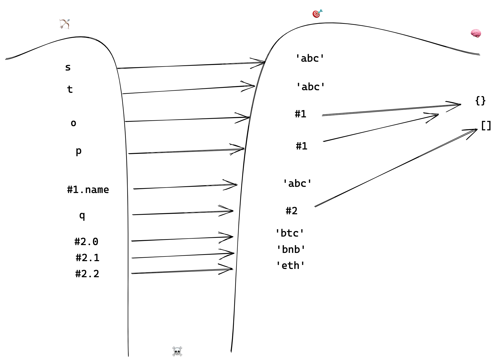

```js
var s
undefined
s
undefined
s = 'abc'
"abc"
var t = s
undefined
var o = {}
undefined
var p = o
undefined
o.name = s
"abc"
o
{name: "abc"}name: "abc"__proto__: Object
p
{name: "abc"}name: "abc"__proto__: Object
q = ['btc', 'bnb', 'eth' ]
(3) ["btc", "bnb", "eth"]0: "btc"1: "bnb"2: "eth"length: 3__proto__: Array(0)
s
"abc"
t
"abc"
o
{name: "abc"}
p
{name: "abc"}
q
(3) ["btc", "bnb", "eth"]
q.name = 'def'
"def"
q
(3) ["btc", "bnb", "eth", name: "def"]0: "btc"1: "bnb"2: "eth"name: "def"length: 3__proto__: Array(0)
```

